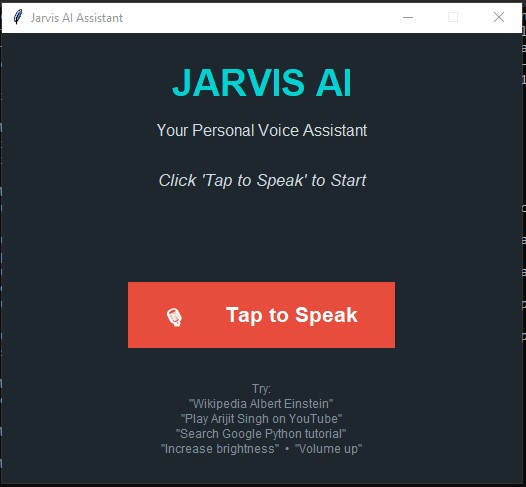

# 🤖 JARVIS AI Voice Assistant

A Python-based personal voice assistant that allows users to interact with their laptop using voice commands.


---

# 📛 **Badges**


---

## 📌 Description

JARVIS AI Voice Assistant is a Python-based desktop voice assistant designed to perform common tasks using simple voice commands.

The project combines Speech Recognition, Text-to-Speech, Web Automation, Wikipedia API, YouTube search, Google search, laptop brightness control, volume control, and a Tkinter-based graphical interface into one simple application.

The goal of this project is to demonstrate how Python can be used to build an interactive voice-controlled desktop assistant.

1. ✨ Features
2. 🎙️ Voice command recognition
3. 🗣️ Text-to-Speech response
4. 🔎 Google search using voice commands
5. ▶️ YouTube video search using voice commands
6. 📖 Wikipedia article search and summary
7. 💡 Laptop brightness control
8. 🔊 Laptop volume control
9. 🌐 Open Google, YouTube, and Wikipedia
10. 🖥️ Simple Tkinter graphical user interface
11. ⚡ Voice-based interaction

    
<details> <summary><strong>🛠️ Setup Guide — Programming Software & IDE</strong></summary>
1. Install Python

This project is written in Python, so Python must be installed on your computer.

Download Python from the official website:

```python
https://www.python.org/downloads/
```

During installation on Windows, make sure to check:

☑ Add Python to PATH


After installation, open Command Prompt or Terminal and verify:

```python
python --version
```

You should see something similar to:

```python
Python 3.x.x
```

If python does not work, try:

```python
py --version
```

2. Choose an IDE / Code Editor

You can use any Python-compatible IDE or editor.

Recommended options:

- Visual Studio Code

Download:

```python
https://code.visualstudio.com/
```

Install the Python extension from Microsoft after installing VS Code.

> PyCharm

Download:

```python
https://www.jetbrains.com/pycharm/
```

PyCharm is another good option for Python development.

IDLE

Python also comes with IDLE, which can be used for basic development without installing another IDE.

For beginners, VS Code is recommended.

</details>
<details> <summary><strong>📦 Prerequisites — Required Python Packages</strong></summary>
## Required Libraries

Before running the project, install the following Python packages:

### Package	Purpose
SpeechRecognition	Converts voice into text
PyAudio	Provides microphone access
pyttsx3	Converts text into speech
requests	Communicates with the Wikipedia API
screen-brightness-control	Controls laptop brightness

The project also uses Python's built-in libraries such as:

tkinter
webbrowser
ctypes
urllib
re


These do not normally require separate installation.

Install Required Packages

Open Command Prompt / PowerShell / Terminal.

Run:

```python
pip install SpeechRecognition pyttsx3 requests screen-brightness-control PyAudio
```

If pip is not recognized, try:

```python
python -m pip install SpeechRecognition pyttsx3 requests screen-brightness-control PyAudio
```

On Windows, you can also try:

```python
py -m pip install SpeechRecognition pyttsx3 requests screen-brightness-control PyAudio
```

Install Packages One by One

If you prefer installing them separately:

```python
pip install SpeechRecognition

pip install pyttsx3

pip install requests

pip install screen-brightness-control

pip install PyAudio
```

Verify Installation

You can verify the installed packages with:

```python
pip list
```

Look for:

SpeechRecognition
PyAudio
pyttsx3
requests
screen-brightness-control


You can also test individual imports:

python -c "import speech_recognition"

python -c "import pyttsx3"

python -c "import requests"

python -c "import screen_brightness_control"


If the command returns without an error, the package is installed correctly.

PyAudio Installation Issue

On some Windows systems, PyAudio may show an installation error.

Try:

```python
python -m pip install --upgrade pip
```

Then:

```python
pip install PyAudio
```

If it still fails, check the Python version and architecture installed on your computer.

</details>
<details> <summary><strong>📥 How to Download and Run the Project</strong></summary>
## Step 1 — Clone the Repository

Open Terminal / Command Prompt and run:

```python
git clone https://github.com/alok-kumar8765/jarvis-ai-voice-assistant.git
```


Move into the project folder:

cd jarvis-ai-voice-assistant

Step 2 — Install Dependencies

Run:

```python
pip install SpeechRecognition pyttsx3 requests screen-brightness-control PyAudio
```

Step 3 — Open the Project

Open the folder in VS Code, PyCharm, or another Python IDE.

The main Python file should look similar to:

```
jarvis-ai-voice-assistant/
│
├── jarvis.py
├── images/
│   └── jarvis-ui.png
└── README.md
```

Step 4 — Run the Assistant

Run:

```python
python jarvis.py
```

If you use Windows and python does not work:

py jarvis.py


The JARVIS AI graphical interface should appear.

Step 5 — Allow Microphone Access

When you click:

🎙️ Tap to Speak


allow your computer to use the microphone if Windows asks for permission.

</details>
<details> <summary><strong>1️⃣ What Is This Project About?</strong></summary>

### JARVIS AI Voice Assistant is a desktop application created using Python.

  It allows users to perform different tasks through voice commands instead of manually typing or navigating through applications.

  The project demonstrates how multiple Python technologies can be combined to create a practical voice-controlled application.

The assistant currently supports:

-Voice recognition
-Text-to-speech
-Web searching
-Wikipedia information
-YouTube searching
-Brightness control
-Volume control
-GUI interaction
</details>
<details> <summary><strong>2️⃣ Why Was This Project Designed?</strong></summary>

> This project was designed to explore how Python, voice recognition, automation, and APIs can work together to create a personal desktop assistant.

The main objectives are:

Learn practical Python development
Understand speech recognition
Work with APIs
Practice GUI development with Tkinter
Explore desktop automation
Create a real-world Python project
Build a foundation for a more advanced AI assistant

Rather than being only a simple command-line program, the project provides a graphical interface and voice-based interaction.

</details>
<details> <summary><strong>3️⃣ Who Can Use This?</strong></summary>

This project can be useful for:

🧑‍💻 Python beginners
🎓 Students learning programming
🛠️ Developers experimenting with automation
🤖 AI and voice-assistant enthusiasts
📚 Anyone interested in learning Python projects
💡 Developers who want a starting point for building their own assistant

The project can also be modified and extended according to individual requirements.

</details>
<details> <summary><strong>4️⃣ How to Use JARVIS</strong></summary>

After starting the application:

Step 1

Click:

🎙️ Tap to Speak

Step 2

Wait for JARVIS to say:

How can I help you?

Step 3

Speak a command.

Example Commands
🌐 Websites
Open Google

Open YouTube

Open Wikipedia

🔎 Google Search
Search Google Python programming

Google search artificial intelligence

▶️ YouTube
Play Arijit Singh on YouTube

Play Python tutorial on YouTube

Search YouTube cricket highlights

📖 Wikipedia
Wikipedia Albert Einstein

Wikipedia Mahatma Gandhi

Wikipedia Artificial Intelligence


JARVIS retrieves the Wikipedia summary and reads it aloud.

💡 Brightness
Increase brightness

Decrease brightness

Set brightness 50

🔊 Volume
Volume up

Volume down

Mute volume

</details>
<details> <summary><strong>5️⃣ Future Improvements</strong></summary>

This project is designed as a foundation that can be expanded with many additional features.

Planned / Possible Improvements

🗣️ Wake Word Detection

"Hey JARVIS" or "Jarvis" to activate the assistant without clicking the button.

🎵 Direct YouTube Playback

Automatically identify and play the requested video instead of only opening search results.

🌦️ Weather Information

Ask JARVIS about current weather and forecasts.

🕐 Time and Date

Voice commands for current time and date.

📂 Application Control

Open and close applications using voice commands.

💻 System Control

Shutdown, restart, sleep, and lock the computer through voice commands.

📁 File Management

Open, search, create, rename, and manage files using voice commands.

📧 Email Automation

Compose and send emails using voice commands.

💬 Messaging

Integration with messaging platforms.

🤖 AI Chat Capability

Integrate an AI model to make JARVIS capable of answering general questions conversationally.

🧠 Context Awareness

Allow JARVIS to understand follow-up commands and maintain conversation context.

🎨 Advanced GUI

Add animations, waveform visualization, themes, system monitoring, and a more futuristic JARVIS-style interface.

🔐 User Authentication

Add voice or PIN-based authentication for sensitive system commands.

🌍 Multilingual Support

Add Hindi and other language support for voice commands and responses.

The long-term goal is to evolve this project from a basic voice assistant into a more capable AI-powered personal desktop assistant.

</details>
📸 Project Preview
JARVIS AI Interface



Connect With Me
> GitHub: https://github.com/alok-kumar8765
Email: alokkaushal42@gmail.com


🙏 Thank You

Thank you for visiting the JARVIS AI Voice Assistant project!

If you find this project useful or interesting:

⭐ Star the repository

🍴 Fork the repository

🐛 Report issues

💡 Suggest improvements

Contributions and suggestions are always welcome.

<p align="center">

🤖 JARVIS AI — Your Voice, Your Assistant.

</p>
